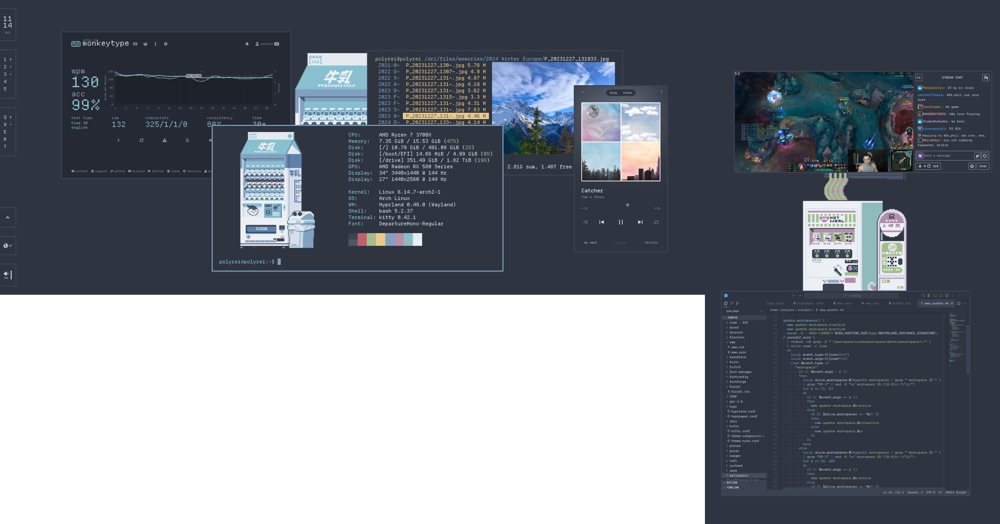
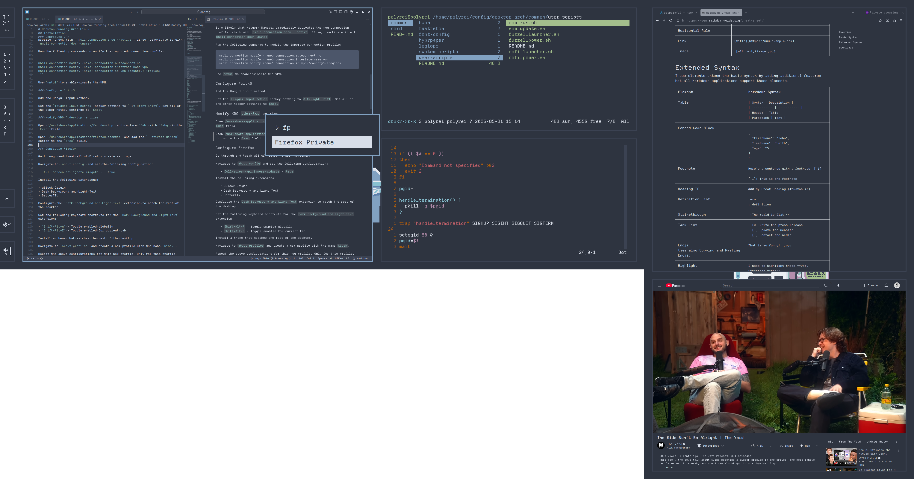

# Desktop running Arch Linux





## Installation

Follow the official Arch Linux installation guide, but take note of the
following points.

### Mount partitions

The guide instructs to mount the EFI partition at `/boot/`, but this causes the
Linux kernel and initial ramdisk images to be installed in the EFI partition.
This is not ideal for a device with multiple operating systems because the
EFI partition should be seen as a common space, not owned by this Arch Linux
instance. It is better for these images to reside in the root partition, both to
minimize confusion and to protect the images from other operating systems that
may overwrite them.

Use the following mounting configuration:

| path         | partition      |
| ------------ | -------------- |
| `/`          | root partition |
| `/boot/efi/` | EFI partition  |

The kernel and initial ramdisk images will still be installed to `/boot/`, but
this directory is inside the root partition, not the EFI partition, which is the
intended configuration.

Grub fully supports running images that reside outside of the EFI partition, so
there is nothing special to be done here. `grub-mkconfig` will automatically
handle this by scanning all partitions for kernel and initial ramdisk images.

### Allow `sudo` without password

Use `visudo` and add the following:

```
%wheel ALL=(ALL:ALL) NOPASSWD: ALL
```

Add the user to the `wheel` group:

```
sudo usermod -a -G wheel <user>
```

### Configure GNU readline autocompletion to be case-insensitive

Add the following line to `/etc/inputrc`:

```
set completion-ignore-case On
```

### Enable services

Run the following command:

```
sudo systemctl enable --now logid
```

### Set default audio output device

List the available audio devices for WirePlumber:

```
wpctl status
```

Take note of the target sink's ID from the above output, and configure the
default sink:

```
wpctl set-default <ID>
```

### Configure VPN

Download the Wireguard `.conf` file from the VPN provider.

Rename the file to `vpn-<country>-<region>.conf`. `<name>` will be used to refer
to `vpn-<country>-<region>` below. `<name>` can be at most 15 characters long.

Run the following command to import the connection profile:

```
nmcli connection import type wireguard file <name>.conf
```

It's likely that Network Manager immediately activates the new connection
profile; check with `nmcli connection show --active`. If so, deactivate it with
`nmcli connection down <name>`.

Run the following commands to modify the imported connection profile:

```
nmcli connection modify <name> connection.autoconnect no
nmcli connection modify <name> connection.interface-name vpn
```

Use `nmtui` to enable/disable the VPN.

### Configure Fcitx5

Add the Hangul input method.

Set the `Trigger Input Method` hotkey setting to `Alt+Right Shift`. Set all of
the other hotkey settings to `Empty`.

### Modify XDG `.desktop` entries

Open `/usr/share/applications/feh.desktop`, replace `feh` with `fehg` in the
`Exec` field, and remove all other existing options (e.g. `--start-at`). Do not
remove the final argument (`%u`).

Open `/usr/share/applications/firefox.desktop` and add the `--private-window`
option to the `Exec` field.

### Configure Firefox

Go through and tweak all of Firefox's main settings.

Navigate to `about:config` and set the following configurations:

- `toolkit.legacyUserProfileCustomizations.stylesheets` - `true`
- `full-screen-api.ignore-widgets` - `true`

Install the following extensions:

- uBlock Origin
- Dark Background and Light Text
- BetterTTV

Configure the `Dark Background and Light Text` extension to match the rest of
the desktop.

Set the following keyboard shortcuts for the `Dark Background and Light Text`
extension:

- `Shift+Alt+A` - Toggle enabled globally
- `Shift+Alt+Z` - Toggle enabled for current tab

Install a theme that matches the rest of the desktop.

Navigate to `about:profiles` and create a new profile with the name `kiosk`.

Repeat the above configurations for this new profile. The differences for this
profile should be the following:

- Disable the setting `Allow pages to choose their own fonts`.
- Disable the setting `Open links in tabs instead of new windows`.

## Packages

### System core packages

- `amd-ucode`
- `base`
- `base-devel` (package builds run by Paru)
- `efibootmgr`
- `git`
- `grub`
- `linux`
- `linux-firmware`
- `man-db`
- `networkmanager`
- `ntfs-3g`
- `openssh`
- `os-prober`
- `paru`
- `pipewire-pulse`
- `sudo`
- `wireguard-tools`

### Session core packages

- `eww`
- `fcitx5`
- `fcitx5-configtool`
- `fcitx5-hangul`
- `fuzzel`
- `grim`
- `hyprland`
- `hyprpaper`
- `logiops`
- `slurp`
- `socat` (Hyprland event monitoring for updating Eww)
- `uwsm`
- `wl-clip-persist`

### Application packages

- `code`
- `discord`
- `fastfetch`
- `feh`
- `firefox`
- `font-manager`
- `gimp`
- `kitty`
- `python-pillow` (Ranger image preview)
- `ranger`
- `unzip`
- `vim`
- `zip`

### Font packages

- `noto-fonts`
- `noto-fonts-cjk`
- `noto-fonts-emoji`
- `ttf-material-icons-git`

## File import

Copy files from this repository to the appropriate locations on the device.

Refer to the following map to determine where to place files:

```
/
|
+-  etc/
|   |
|   +-  inputrc
|   |     Configurations for programs that use GNU readline
|   |
|   +-  logid.cfg
|   |     Configurations for Logiops
|   |
|   +-  fonts/
|       |
|       +-  local.conf
|       |     Configurations for fonts
|       |
|       +-  conf.d/
|             Enabled system presets for fonts
|
+-  usr/
|   |
|   +-  local/
|   |   |
|   |   +-  share/
|   |   |   |
|   |   |   +-  fonts/
|   |   |       |
|   |   |       +-  otf/
|   |   |       |     OpenType fonts
|   |   |       |
|   |   |       +-  ttf/
|   |   |             TrueType fonts
|   |   |
|   |   +-  bin/
|   |         Custom scripts and programs executable by all users
|   |         On PATH by default
|   |         Many scripts here function like global aliases, simply running
|   |         existing commands with common options, accessible by all users
|   |         Scripts that do user-specific tasks and pull from user-specific
|   |         configurations should go in the user's home directory instead
|   |         (e.g. /home/polyrei/scripts/)
|   |
|   +-  share/
|       |
|       +-  applications/
|             XDG desktop entries
|
+-  root/
|   | Home directory for root user
|   | Everything inside here applies only to the root user
|   |
|   +-  .bash_profile
|   |     Bash script that is run once on login
|   |     Sets environment variables
|   |
|   +-  .bashrc
|   |     Bash script that is run at the start of every new Bash instance
|   |     Configures interactive Bash instances
|   |
|   +-  .vimrc
|   |     Configurations for Vim
|   |
|   +-  .config/
|         Configurations for programs
|
+-  home/
    |
    +-  polyrei/
        | Personal home directory
        | Everything inside here applies only to the user polyrei
        |
        +-  .bash_profile
        |     Bash script that is run once on login
        |     Sets environment variables
        |     Starts graphical session
        |
        +-  .bashrc
        |     Bash script that is run at the start of every new Bash instance
        |     Configures interactive Bash instances
        |
        +-  .vimrc
        |     Configurations for Vim
        |
        +-  .gitconfig
        |     Configurations for Git
        |
        +-  .config/
        |     Configurations for programs
        |
        +-  .ssh/
        |     SSH keys
        |
        +-  .mozilla/
        |   |
        |   +-  firefox/
        |       |
        |       +-  <Firefox profile>/
        |           |
        |           +-  chrome/
        |               |
        |               +-  userChrome.css
        |               |     CSS styling overrides for Firefox UI
        |               |
        |               +-  userContent.css
        |                     CSS styling overrides for Firefox content
        |
        +-  scripts/
              Personal scripts
```
